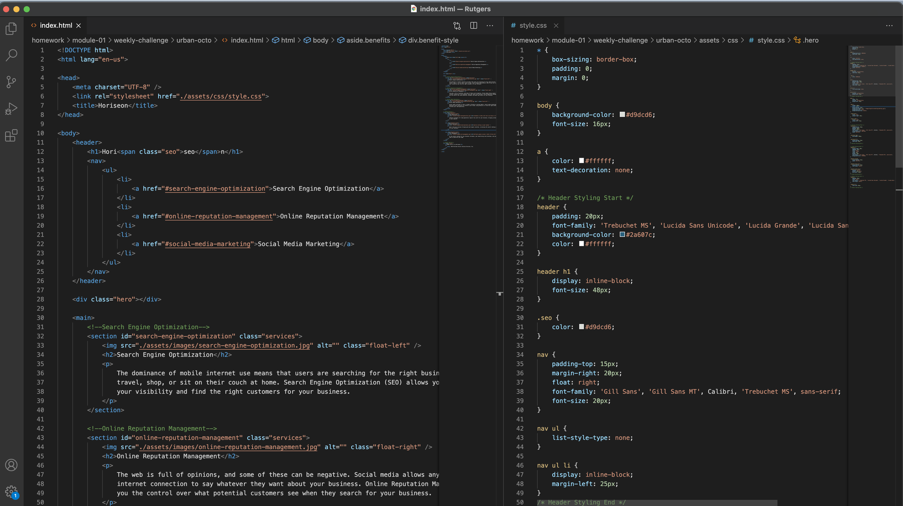

# Urban-Octo Module-01 Challenge
> Refactored code for a cleaner readability and added accessible semantic tags

[Find the deployed website here!](https://ashryan125.github.io/urban-octo/)

Html code needed multiple divs changed to the correct semantic tags and classes reworked to clean up the css. Also add a few comments to help break up the code.

The css code needed to be minimized and new classes established. Further, added comments to sections and reordered flow to coincide with html flow.

## Horiseon Website
> Finalized company landing page

